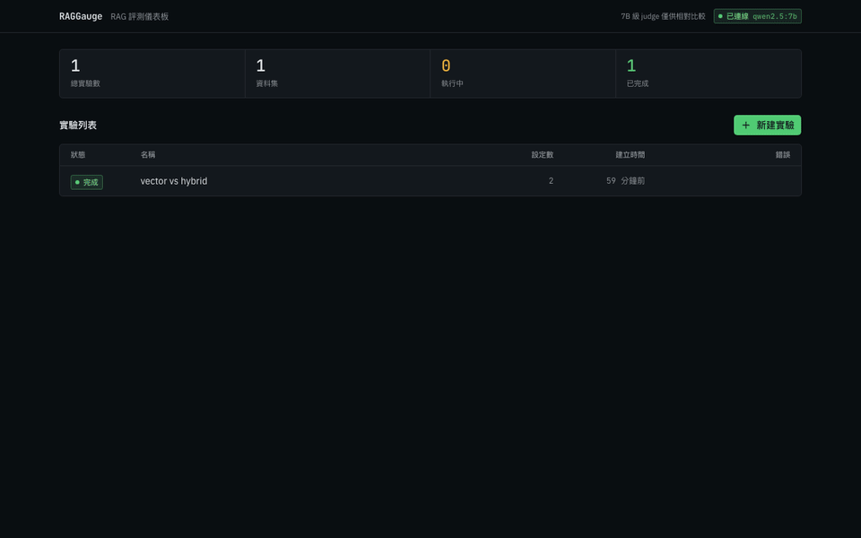
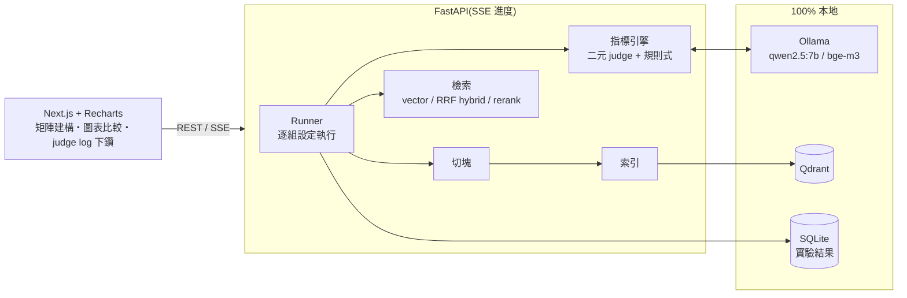

# RAGGauge 📊

> **自架、上傳即用的 RAG 評測 Dashboard**
> 上傳文件集與測試問答 → 一鍵掃描 chunk size × 檢索策略矩陣 → 互動圖表找出最佳組合。
> 100% 本地(Ollama),指標全部透明可解釋。

[](https://github.com/yusyuan9224/raggauge/actions)
[](LICENSE)
[](backend/pyproject.toml)



## 為什麼需要 RAGGauge?

人人都會「串一個 RAG」,但沒人說得清**自己的 RAG 好不好、為什麼這樣設計**。現有評測工具(RAGAS、TruLens)都是 Python 函式庫 — 要自己寫程式、看不到圖、對非工程角色不友善。

RAGGauge 是一個 **self-hosted Web Dashboard**:

- 📂 上傳文件集 + QA 測試集(或一鍵載入內建範例)
- 🧪 參數矩陣掃描:chunk size × 檢索策略(純向量 / BM25+向量混合 / +rerank)× top-k
- 📈 互動圖表比較(長條、延遲-品質散點、雷達),自動標出最佳組合
- 🔍 **每個指標可下鑽到逐句 judge 紀錄** — 數字不是黑盒
- 📤 匯出最佳設定 JSON,直接套用到你的 RAG 應用

## 指標(全部透明、可解釋)

| 指標 | 怎麼算 | 用到 LLM judge? |
|------|--------|----------------|
| Retrieval Recall | golden 證據片段是否被檢回(子字串比對) | ❌ 規則式 |
| Context Precision | 逐 chunk 二元判斷「對回答有用?」→ Average Precision | ✅ 二元判斷 |
| Faithfulness | 答案拆原子陳述 → 逐句問「context 可支持?」→ 支持比例 | ✅ 二元判斷 |
| Answer Correctness | claims 分解雙向比對 golden answer → precision/recall → F1 | ✅ 二元判斷 |
| Latency | 檢索 / 生成耗時(ms) | ❌ 量測 |

**設計原則**:7B 級本地模型做連續評分不可靠(學術研究共識是 judge 需 ≥14B),所以所有 LLM 判斷都拆成**二元判斷**再聚合,且每次判斷的理由都記錄在 `judge_log` 供檢視。Dashboard 會明確標示 judge model 並提醒「絕對值僅供相對比較」。

> 真實案例:內建範例資料集中有一題「年繳訂閱用兩個月後取消可以退錢嗎?」,RAG 答案過度保守拒答(其實 context 裡有答案),answer correctness 正確給出 0 分 — judge log 裡看得到完整推理過程。**這正是你需要評測工具的原因。**

## 快速開始

**前置需求**:[Docker](https://docs.docker.com/get-docker/) 與 [Ollama](https://ollama.com)。

```bash
# 1. 模型(一次性,約 6GB)
ollama pull qwen2.5:7b && ollama pull bge-m3

# 2. 一鍵啟動
git clone https://github.com/yusyuan9224/raggauge.git
cd raggauge
docker compose up --build
```

開啟 **http://localhost:3000**,點「載入內建範例」即可體驗(智慧門鎖 FAQ,8 題)。

<details>
<summary>不用 Docker 的本機開發模式 / CLI</summary>

```bash
# 後端
cd backend && uv sync
uv run uvicorn raggauge.server:app --port 8000 --reload

# 前端(另一個終端機)
cd frontend && pnpm install && pnpm dev

# 或純 CLI 跑單組設定
cd backend
uv run raggauge run --corpus ../examples/corpus --qa ../examples/qa.json \
  --chunk-size 400 --strategy hybrid --top-k 4 --json result.json
```

</details>

## QA 測試集格式

```json
[
  {
    "question": "電池沒電了打不開門怎麼辦?",
    "golden_answer": "可使用門鎖底部的 USB-C 緊急供電孔臨時供電開鎖。",
    "golden_evidence": ["可使用門鎖底部的 USB-C 緊急供電孔"]
  }
]
```

`golden_evidence` 是原文片段(可多條),retrieval recall 靠它做規則式比對;留空陣列代表「應拒答」的對抗題。

## 架構



## 技術決策(為什麼這樣設計)

| 問題 | 決策 | 理由 |
|------|------|------|
| 用 RAGAS 還是自建? | 自建 | RAGAS 0.4 強制依賴 langchain 全家桶(映像體積);指標黑盒;自建二元判斷對 7B judge 更穩 |
| 中文 BM25 | jieba 斷詞 + rank-bm25(程序內) | Qdrant/FastEmbed 原生 BM25 對中文幾乎無效(MIRACL-zh recall 0.05%,qdrant/qdrant#8014) |
| 混合檢索融合 | Reciprocal Rank Fusion | 只用排名,迴避 dense(bounded)與 BM25(unbounded)分數量綱不相容 |
| Rerank | bge-reranker-v2-m3(optional) | Ollama 無原生 rerank API;FlagEmbedding 拉 torch,故設為選配,未安裝自動退回 hybrid |
| judge 可信度 | 二元判斷 + 逐句 log + UI 警示 | 評測工具的數字必須可被檢驗,不能要求使用者「相信魔法」 |

## 與 ClauseLens 的關係

RAGGauge 是為了調校姊妹專案 [ClauseLens](https://github.com/yusyuan9224/clauselens)(本地合約風險審查器)的檢索參數而生 — 用數據回答「為什麼 chunk 這樣切、為什麼選這個策略」。

## 限制與聲明

- judge 用本地 7B 模型:指標適合**同一資料集上的相對比較**(A 設定 vs B 設定),絕對值請謹慎解讀
- 評測速度受限於本地推理:一組設定 × 8 題約 3–5 分鐘(Apple Silicon / 中階 GPU)
- rerank 策略需自行安裝 FlagEmbedding(`uv add FlagEmbedding`),否則自動退回 hybrid

## 貢獻

歡迎 PR!請見 [CONTRIBUTING.md](CONTRIBUTING.md)。

## License

[MIT](LICENSE)
